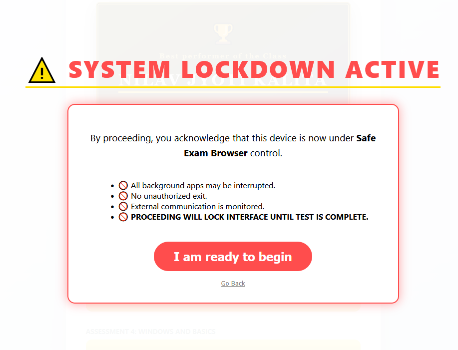
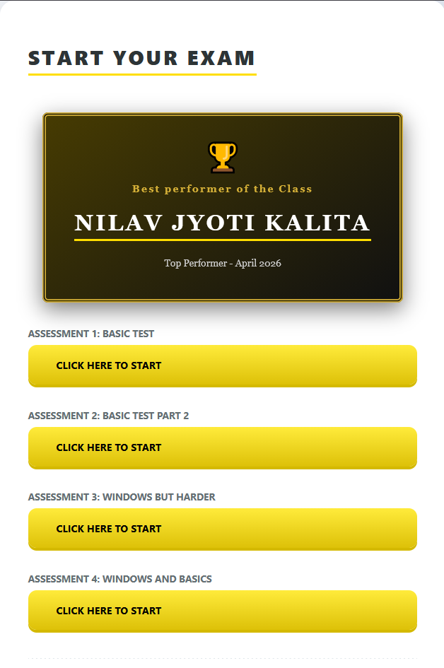
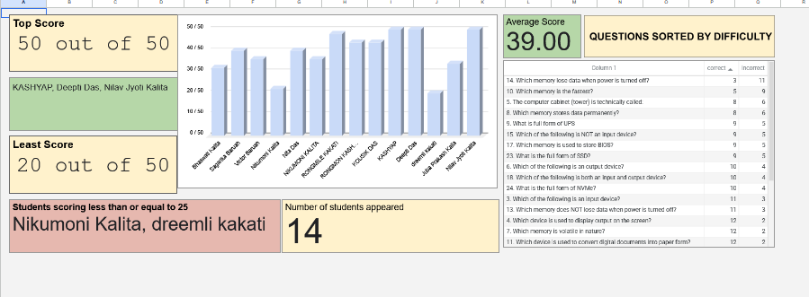

# IMAE: Integrated Management & Analytics Engine
> **Status:** Active / Production
> **Instructor:** Nilav Jyoti Kalita
> **Current Version:** `v1.0.0`
> **Last Updated:** April 2026

## Changelog
### [1.0.0] - 2026-04-23
- Initial release of the IMAE ecosystem.
- Integrated Safe Exam Browser (SEB) with GitHub portal.
- Developed Google Sheets Dashboard with Trend Analysis and Question Difficulty sorting.
- Implemented "System Lockdown" warning screen.

## 1. Project Vision
IMAE was developed to solve the "AI-Arms Race" in digital examinations. By integrating a secure browser environment with a centralized web gateway and a data analytics backend, IMAE eliminates unauthorized AI assistance (screenshots/chatbots) while providing deep insights into student performance.

## 2. Technical Architecture
The system operates on a three-tier architecture:

* **Gateway:** A GitHub-hosted portal that acts as a centralized "Exam Hub."
* **Security:** [Safe Exam Browser (SEB)](https://safeexambrowser.org/) integration to lock down the OS and disable external tools.
* **Analytics:** A Google Sheets-based engine for real-time trend analysis.

## 3. Key Features
### 🛡️ Lockdown Security
* Disables screenshot shortcuts (Win+Shift+S).
* Prevents browser tab switching.
* "System Lockdown Active" handshake screen for student accountability.
### 🖥️ Student Portal Interface

*Figure 1: The "System Lockdown" handshake screen students see after clicking start exam.*

*Figure 2: The interface that users see when they open the app. A reward system has been included*

### Dynamic Shuffle Engine:
* Leverages Google Forms' randomization toggle to shuffle question order and multiple-choice options for every session, neutralizing "neighbor-copying" in a physical classroom setting.

### 📊 Pedagogical Insights (The Engine)
* **Difficulty Sorting:** Automatically identifies which questions have the highest failure rates.
* **Performance Trends:** Uses sparklines to track student improvement across different modules (e.g., Hardware vs. Windows).
* **Automated Flagging:** Instant identification of students scoring below the 50% threshold.
### 📊 Analytics Dashboard

*Figure 2: Real-time trend analysis and question difficulty sorting.*

## 4. Maintenance Workflow
To add a new exam to the IMAE ecosystem:
1. Update the exam link in `index.html`.
2. Commit and Push to GitHub.
3. No SEB re-configuration required.
